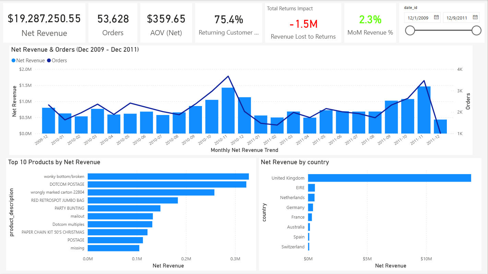
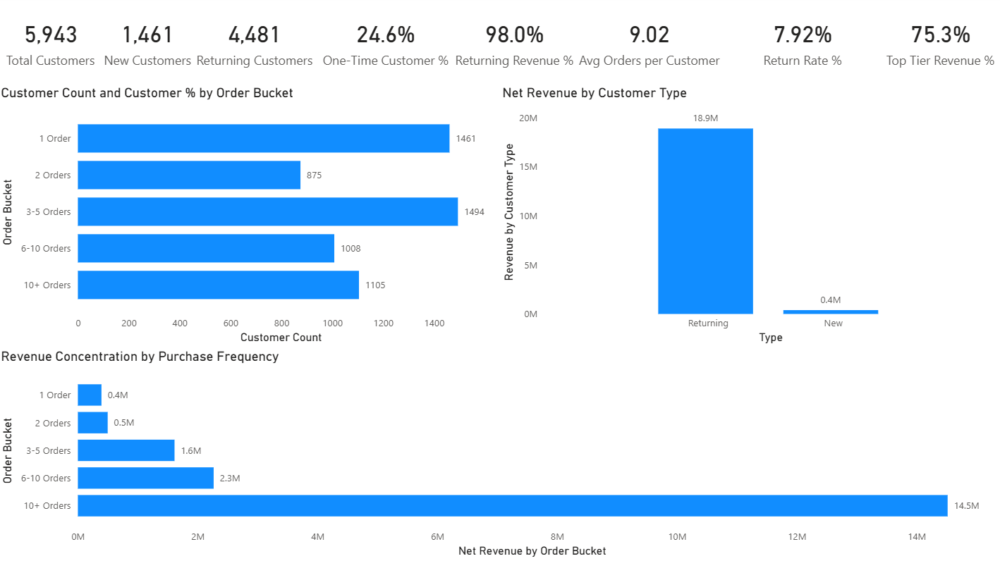
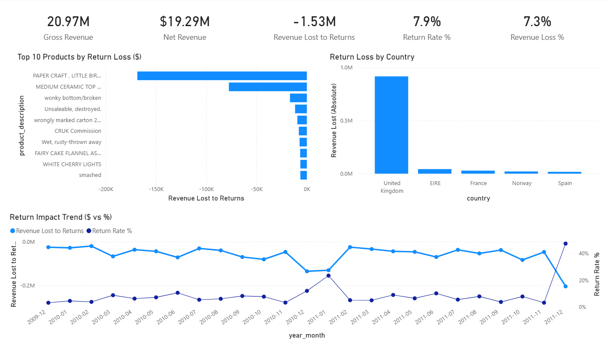
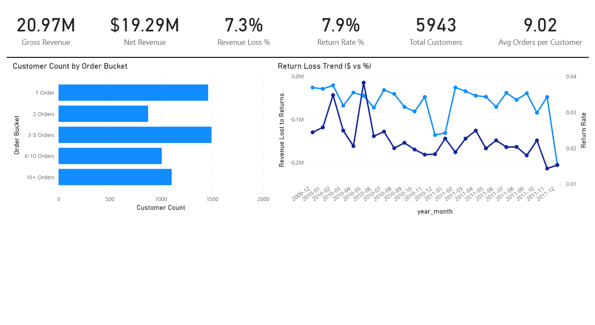
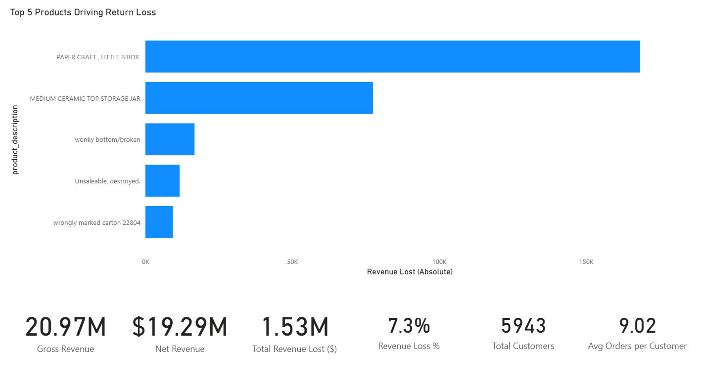

# Retail Revenue Optimization & Risk Analysis

This analysis reveals that approximately 7.3% of revenue is lost due to returns, totaling ~$1.5M. Return impact is concentrated among a small number of SKUs, while returning customers drive the majority of revenue. December 2011 shows distortion likely due to partial-month data. These insights highlight both revenue concentration risk and temporal misalignment in return recognition.

The goal was to simulate a real-world BI reporting workflow: ingest raw transactional data, model it into a star schema, build KPIs, and design multi-layer dashboards for executive and operational audiences.

## Project Overview

This project analyzes transactional retail data to evaluate:
- Revenue performance trends
- Customer purchasing behavior
- Return impact and financial leakage
- Operational risk drivers
- Executive-level performance summary

## Project Explanation (Interview Summary)

This project simulates a real-world business intelligence workflow for retail revenue analysis.

I ingested raw transactional data into PostgreSQL, staged it without modification, and modeled it into a star schema consisting of a central fact table and supporting dimension tables. This structure allowed me to build scalable analytical queries and Power BI dashboards.

Using DAX measures in Power BI, I created KPIs for revenue performance, customer behavior, and return-related financial loss. The dashboards are structured across multiple analytical layers, ranging from high-level executive summaries to deeper operational diagnostics.

The analysis revealed that approximately 7.3% of total revenue is lost to product returns, with the majority of return-related losses concentrated among a small subset of SKUs. Additionally, the data shows that returning customers generate most revenue, indicating strong retention but also a potential reliance on repeat buyers.

The project demonstrates end-to-end data analytics capabilities including data ingestion, modeling, KPI development, dashboard design, and business interpretation.

---

## Dataset

- **Source:** Online Retail II (UCI)

## Tools Used

- PostgreSQL
- Power BI
- DAX

## Repository structure

```text
Retail-revenue-optimization/
│
├── data_raw/
│ └── online_retail_raw.csv
│
├── docs/
│   ├── dashboard_revenue_overview.PNG
│   ├── dashboard_customer_retention.PNG
│   ├── dashboard_returns_risk.PNG
│   ├── dashboard_executive_summary.PNG
│   └── dashboard_performance_drivers.PNG
│
├── powerbi/
│ └── retail_revenue_dashboard.pbix
│
├── python/
│ └── exploratory_analysis.ipynb
│
├── sql/
│ ├── 01_staging.sql
│ ├── 02_dimensions.sql
│ ├── 03_fact_sales.sql
│ ├── 03_fact_sales_revised.sql
│ └── 04_kpi_views.sql
│
└── README.md
```

## Dataset Description

The dataset contains invoice-level transactional records including:
- Invoice number
- Product Description
- Quantity
- Unit Price
- Invoice Date
- Customer ID
- Country

Grain:
One row per invoice-line transaction (product x invoice).

Returns are represented as negative quantity transactions.

---

## Data Engineering & Modeling

### Data Ingestion (PostgreSQL)
- Raw CSV staged in 'staging.online_retail_raw'
- CustomerID stored as floating-point in source -> staged as NUMERIC
- Indexed invoice_no, customer_id, invoice_date, stock_code for performance

### Star Schema Design
Fact Table:
- 'retail.fact_sales'
	- invoice_no
	- product_id
	- Quantity
	- unit_price
	- invoice_date
	- return flag
	- revenue (derived)

Dimension tables
- 'retail.dim_date'
- 'retail.dim_product'
- 'retail.dim_customer'
- 'retail.dim_country'

Relationships:
- One-to-many(dimension -> fact)
- Single-direction filter propagation
- Avoided many-to-many ambiguity

---

## Key Metrics & Definitions

*Gross Revenue*
Sum of Quantity x Unit Price (including negative transactions).

*Net Revenue*
Gross Revenue after returns.

*Revenue Lost to Returns ($)* 
Absolute value of negative revenue transactions.

*Revenue Loss %*
Revenue Lost ÷ Gross Revenue (within filter context).

*Return Rate %*
Return revenue ÷ Gross Revenue (transaction-month based).

*Customer Segmentation*

- One-time customers
- Repeat customers
- Revenue contribution by segment

---

## Dashboard Architecture

### Page 1 - Revenue Performance Overview
- Monthly revenue trends
- Order volume
- Average order value
- Top countries by revenue

### Page 2 - Customer & Retention Analysis
- New vs returning customers
- Revenue by order bucket
- Customer order distribution
- Revenue concentration by purchase frequency

### Page 3 - Returns & Risk Analysis
- Return loss trend ($ vs %)
- Top 5 products driving return loss
- Return rate by Country

### Page 4 - Executive Summary
- High-level revenue KPIs
- Customer scale indicators
- Financial leakage metrics
- Primary risk drivers

### Page 5 - Performance & Risk Drivers
- Consolidated operational view
- SKU-level concentration risk
- Combined revenue and return impact analysis

---

## Dashboard Preview
The following screenshots highlight the primary analytical views developed in Power BI. The dashboards are structured to support both executive-level summaries and deeper operational diagnostics.

### Revenue Performance Overview


### Customer & Retention Analysis


### Returns & Risk Analysis


### Executive Summary


### Performance & Risk Drivers


---

## Key Findings
- \~7.3% revenue lost due to returns (\~$1.5M impact)
- December 2011 shows a return rate spike likely due to partial-month data
- Revenue leakage concentrated among a small number of SKUs
- Returning customers drive majority of revenue

---

## Business Implications

- A small number of SKUs drive disproportionate return loss.
- Revenue timing can distort monthly performance metrics.
- Strong dependence on returning customers suggests retention strength but concentration risk.

---

## Data Considerations
- December 2011 likely represents partial-month data
- Returns are recorded in the transaction month, not original sale month
- Timing differences between original purchases and return transactions
- No direct linkage between return and original invoice in current model

---

## Data Validation & Quality Checks
- Verified row count after ingestion
- Checked for null customer IDs
- Confirmed negative quantity behavior for returns
- Identified partial-month truncation in December 2011

---

## Analytical Decisions
- Preserved raw transactional structure before Modeling
- Avoided pre-aggregated flat models
- Used star schema for scalability
- Separated executive summary from operational deep dives
- Annotated potential denominator distortion in final month

---

## Potential Improvements
- Cohort-adjusted return rate (link returns to original purchase month)
- Daily-normalized metrics for partial-month adjustments
- Product margin analysis (if cost data available)
- Predictive return Modeling
- Customer lifetime value segmentation

---

## Architectural & Analytical Highlights
- Designed star schema with clear fact/dimension separation  
- Implemented DAX measures that respect filter context and temporal behavior  
- Identified and annotated denominator distortion in partial-month data  
- Preserved transactional grain to avoid premature aggregation  
- Distinguished operational reporting from executive-level summaries  
- Evaluated revenue concentration risk among high-return SKUs  
- Documented data caveats and structural limitations
---
